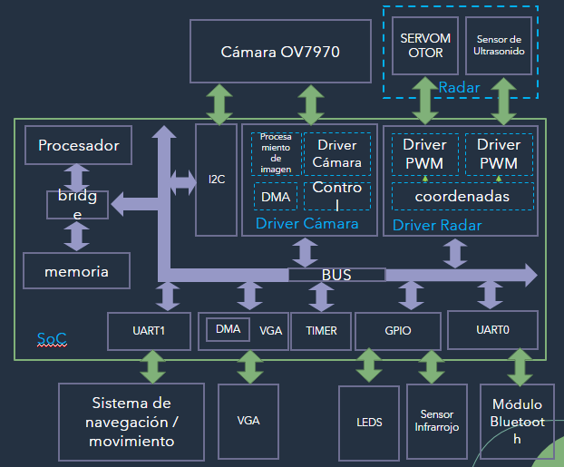

# W07_Entrega-_final

ROBOT CARTOGRAFICO 

El proyecto consiste en un robot el cual se encuentra en un laberinto, y este debe navegar atraves de el hasta llegar al final, en el recorrido se encontrara con algunas figuras de diferentes colores, las cuales debe detectar; y con la informacion que recolecte debe realizar un mapa del laberinto. Para la realizacion de este dispositivo se hicieron uso de diferentes perifericos que nos ayudaran a obtener la informacion necesaria y los cuales posteriormente observaremos con mayor detalle. En la imagen que encontramos a continuacion observamos el SoC del robot. 

 

