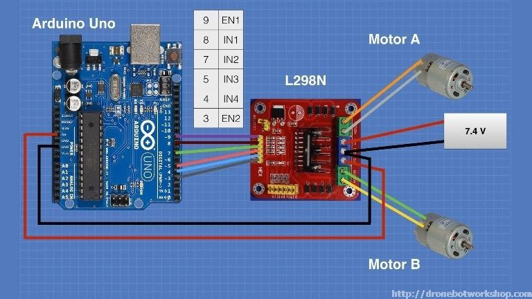

# W07_Entrega-_final

# ROBOT CARTOGRAFICO 

El proyecto consiste en un robot el cual se encuentra en un laberinto, y este debe navegar atraves de el hasta llegar al final, en el recorrido se encontrara con algunas figuras de diferentes colores, las cuales debe detectar; y con la informacion que recolecte debe realizar un mapa del laberinto. Para la realizacion de este dispositivo se hicieron uso de diferentes perifericos que nos ayudaran a obtener la informacion necesaria y los cuales posteriormente observaremos con mayor detalle. En la imagen que encontramos a continuacion observamos el SoC del robot. 

  
 

Este SoC se encuentra compuesto primeramente por el procesador RISC-V, con su respectiva memoria donde se encontraran las instrucciones y para realizar la conexion con cada uno de los perifericos se hace uso de un bus tipo Wishbone. A continuacion veremos cada uno de los perifericos implementados. 

<h3> ULTRASONIDO </h3>

El sensor ultrasonido utilizado para la realizacion del proyecto fue el HC-SR04. Este dispositivo fue usado con el proposito de realizar el mapeo del laberinto y asi poder detectar los obstaculos o en nuestro caso las paredes y del mismo modo los caminos que se encontraban libres. Por otra parte, primero observaremos el driver implementado para lograr un correcto funcionamiento de este dispositivo. Para ellos debemos tener en cuenta que el ultrasonido para lograr realizar mediciones de distancia lo que hace es enviar una señal sonora, y cuenta el tiempo que tarde en llegar nuevamente, esto permite hacer una relacion entre este tiempo y la distancia a la que se encuentra en objeto, la cual sera dada por la siguiente ecuacion:

<h3> INFRARROJO </h3>
El sensor infrarrojo utilizado fue el POLOLU-2459

<h3> SERVOMOTOR </h3>

El servomotor utilizado fue el 

<h3> MOTORES </h3>

Para el movimiento del carrito se hizo uso de dos motores DC en conjunto con un puente H L298, esto para evitar que debido a un pico elevado de corriente se genera un daño en la tarjeta de arduino, las conexiones realizadas son las que podemos observar en la imagen que se encuentra a continuacion: 

 

<h3>CAMARA</h3>}
